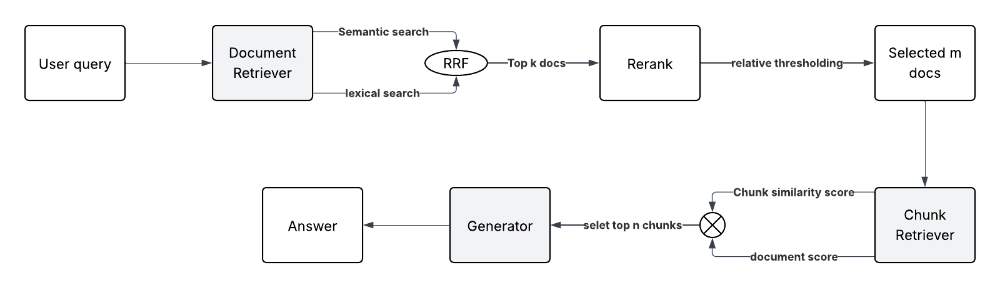

# PaperQA

An AI agent that answers questions about research papers from arXiv on a specific research topic.

**NB:** So far it has 25 research papers on RAG.

The goal is to make it easy for engineers and scientists to find quick, literature-backed answers to specific design choices.

## 1. Process

We use a two-stage hierarchical retrieval with document gating.

### Demo video

<video src="Video.MOV" controls width="100%">
  Your browser does not support the video tag. [Watch the demo video](Video.MOV) instead.
</video>

## 2. Stages

### Preprocessing

I iterated on this stage so documents are processed and stored for effective downstream retrieval.

##### 1. Data modeling & section processing
- **Pydantic** data structures for documents and chunks, with rich metadata per chunk for retrieval  
- Extracted sections and used **GPT** for section-level summaries (key concepts + domain terms)  
- **GPT** document-level summary from section summaries, used for document-level filtering before chunk retrieval  

##### 2. Chunking & embedding
- Sentence-level chunking per section (papers already structure ideas by section)  
- Embedded chunks and document summaries with **OpenAI’s small embedding model (1536 dimensions)** 

### Document Retrieval

This is the most important stage, mistakes here can lead to selecting irrelevant chunks later. I use hybrid retrieval (semantic + keyword search), keyword matching captures domain terms, semantic search handles synonyms and paraphrases. Because BM25 was difficult to integrate on Supabase, Lexical retrieval is implemented using PostgreSQL full-text search with a GIN index over a tsvector representation, which provides token-based matching over document summaries.

To make semantic search fast, I use an IVFFLAT ANN index with 5 inverted lists. The number of lists was chosen based on the current corpus size. This only performs distance computations with the most relevant clusters at query time

The semantic and a lexical scores are computed per document, then fused with Reciprocal Rank Fusion (RRF). For each document $d$:

$$\text{RRF}(d) = \sum_{r \in \{\text{semantic}, \text{lexical}\}} \frac{1}{k + \text{rank}_r(d)}$$

where $k$ is a constant (e.g. 60) and $\text{rank}_r(d)$ is $d$'s 1-based rank in ranking $r$. Documents ranking well in both lists get a higher score. The reason for using fused score is to make this scalable with a larger corpus where we want to filter out docs with low RRF; at ~25 docs I still pass all of them to the next stage, and RRF just helps with reordering.

After RRF, the documents are reranked with Cohere's rerank-english-v3.0, then selected using a relative threshold so the number of documents returned adapts to the query. A document $d$ is kept if:

$$d.\text{rerank\_score} \geq \max_{\text{docs}} \text{rerank\_score} - \Delta \quad \text{and} \quad d.\text{rerank\_score} \geq \text{MIN\_SCORE}$$

We apply a relative threshold with a minimum score to adapt document selection to each query and filter low-quality matches. The goal is to return as many papers as actually contain the answer (e.g., 10, 2, or 0). In practice, this approach works well when reranker confidence is high; queries with low reranker scores are filtered by the absolute minimum score.

### Chunk Retrieval

The selected documents and their rerank scores are passed from the previous stage. Each chunk is scored as:

$$\text{chunk\_score} = \text{rerank\_score}_d \times \text{sim}(c, q)$$

where $d$ is the parent document, $c$ is the chunk, and $\text{sim}(c,q)$ is the chunk–query semantic similarity. Chunk relevance is modulated by document relevance. The top 10 chunks are selected for answer generation.

### Answer Generation

The top 10 chunks' content is passed as context to the language model. If a question cannot be answered from the docuemnts, we rely on the parametric knowledge of the model to generate the answer. The model is good at concept explaination, comparison between methods, and also evidence providing.

## 3. Improvements

- Extract documents through web scraping—what are the best methods for that?

- Cache and monitor results for continuous improvement
- Raw user input must not be passed to the system, there should be a layer that processes this input into a more meaningful query.
- To make this more powerful, we could enhance the retrieval quality by training a knowledge retriever.
- Evaluate answers using token‑level F1.
- Report Exact Match (EM) scores.
